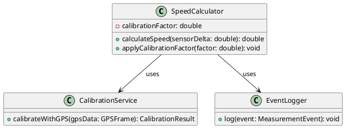

# Level 4 – Code / Class Diagram

> **C4 guidance:** Optional deepest level. Shows how components are implemented — class diagrams, ER diagrams, etc. Usually auto-generated from source code.  
> Tooling: [C4-PlantUML](https://github.com/plantuml-stdlib/C4-PlantUML) · [Structurizr](https://structurizr.com/) · [Mermaid C4](https://mermaid.js.org/syntax/c4.html)

---

## Notes

> Add explanatory notes, decisions, or caveats about this diagram here.
