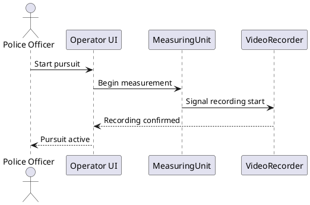

# RS-01: <Scenario Name>

> **Guidance:** Template for a runtime scenario. Describe the trigger, participants, and steps.  
> Use sequence diagrams (PlantUML / Mermaid) to illustrate interactions between building blocks.

---

## Context

> What use case or feature does this scenario represent? Who triggers it?

## Participants

| Participant | Role |
|-------------|------|
|             |      |

## Sequence Diagram

## Steps

| # | Actor | Action | Description |
|---|-------|--------|-------------|
| 1 |       |        |             |
| 2 |       |        |             |

## Error / Alternative Paths

> Describe what happens if something goes wrong or an alternative flow occurs.

## Notes

> Any additional remarks about this scenario.
